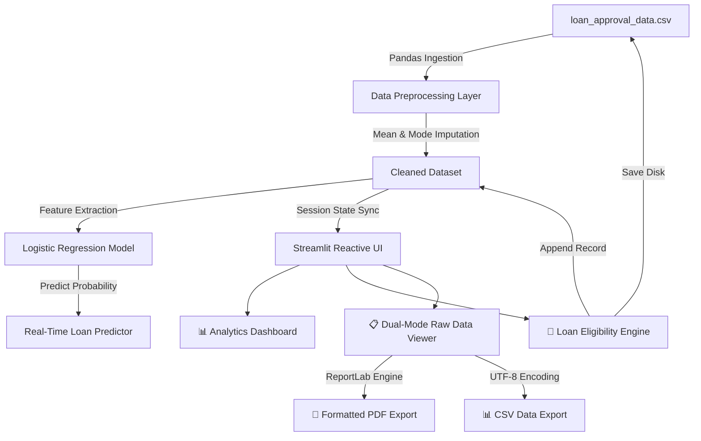
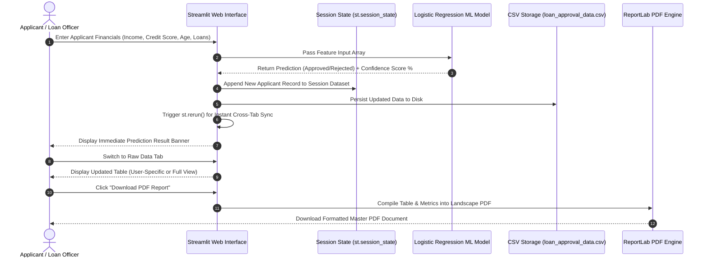

# 🏦 FinScore: ML-Driven Credit Decision Engine

An end-to-end Machine Learning powered loan approval analytics and credit risk decision platform. **FinScore** ingests financial applicant data, cleans missing values dynamically through automated imputation, trains a Logistic Regression risk classifier, and serves real-time loan approval predictions with probability confidence scores via an interactive Streamlit dashboard.

---

## 🌟 Key Features

* **📊 Interactive Analytics Dashboard**: Live metrics (*Total Applications*, *Avg Income*, *Approval Rate %*, *Avg Credit Score*), Plotly Donut charts for approval distribution, and Income vs. Credit Score scatter plots.
* **🚀 Real-Time Loan Eligibility Calculator**: Instant ML-based credit risk assessment with probability confidence scores.
* **📋 Dual-Mode Raw Data Management**:
  * **User-Specific View**: Instantly inspect records created during the current session or search by specific `Applicant_ID`.
  * **Full Dataset View**: Browse, filter, and sort all 1,000+ dataset records.
* **📄 One-Click Master PDF & CSV Export**: Generate formatted, multi-page PDF credit reports (using ReportLab) or export CSV data on demand.
* **🛡️ Fault-Tolerant & Reactive**: Graceful NaN handling, automated imputations, session state synchronization, and zero runtime crashes.

---

## 🏗️ System Architecture & Workflow Flowcharts

### 1. High-Level Architecture Diagram



---

### 2. User Journey & Data Pipeline Flowchart



---

## 🛠️ Technology Stack

| Domain | Technology / Library | Purpose |
| :--- | :--- | :--- |
| **Language** | Python 3.8+ | Core application logic |
| **Web Framework** | Streamlit | Interactive web application frontend & state management |
| **Data Processing** | Pandas, NumPy, scikit-learn (`SimpleImputer`) | Data cleaning, mean/mode imputation & manipulation |
| **Machine Learning** | scikit-learn (`LogisticRegression`) | Binary classification for credit risk assessment |
| **Data Visualization**| Plotly Express | Interactive charts (Donut charts, Scatter plots) |
| **Document Export** | ReportLab | Programmatic PDF generation with styled tables |

---

## ⚡ How to Run the Project

### 1. Prerequisites
Ensure you have **Python 3.8+** installed:
```bash
python --version
```

### 2. Clone Repository & Install Dependencies
```bash
git clone https://github.com/sawantyash07/-FinScore-ML-Driven-Credit-Decision-Engine.git
cd -FinScore-ML-Driven-Credit-Decision-Engine
pip install -r requirements.txt plotly reportlab
```

### 3. Launch Web Application
```bash
streamlit run app.py
```
> The application will open automatically in your browser at `http://localhost:8501` (or `http://localhost:8502`).

---

## 🎯 Interview Presentation Guide (How to Explain in an Interview)

Use this structured pitch when explaining this project to technical interviewers:

### 🗣️ 30-Second Elevator Pitch
> *"FinScore is a full-stack Machine Learning credit decision engine I built using Python and Streamlit. It solves manual underwriting bottlenecks by automating applicant data preprocessing, training a Logistic Regression risk model on financial indicators, and providing real-time loan approval decisions with probability scoring. It includes reactive session-state management, dual-mode tabular views, and automated PDF report generation via ReportLab."*

---

### 💡 Key Technical Talking Points

#### 1. Data Cleaning & Imputation Pipeline
* **Challenge**: Raw financial datasets frequently contain missing values in numeric fields (e.g., Credit Score, Income) and categorical fields (e.g., Employment Status).
* **Solution**: Applied scikit-learn's `SimpleImputer` using `mean` strategy for numeric attributes and `most_frequent` mode for categorical attributes.

#### 2. Machine Learning Model Choice
* **Choice**: `LogisticRegression(max_iter=1000)`.
* **Why**: Provides calibrated probability output via `.predict_proba()` which serves as a transparent *Confidence Score* for financial risk assessment, adhering to explainable AI principles in banking.

#### 3. State Reactivity in Streamlit
* **Challenge**: Streamlit scripts execute top-to-bottom, meaning updates made in forms don't automatically reflect in earlier tabs on the same run.
* **Solution**: Leveraged `st.session_state` to store the active DataFrame and `st.rerun()` upon form submission to immediately sync data across the Dashboard, Predictor, and Raw Data views.

#### 4. Programmatic PDF Document Export
* **Solution**: Integrated ReportLab `SimpleDocTemplate` in landscape mode to dynamically format 20+ dataset columns, header metadata, summary statistics, and alternating row styling into a downloadable PDF document.

---

## 📂 Project Structure

```
FinScore-ML-Driven-Credit-Decision-Engine/
├── app.py                            # Main Streamlit Application (Dashboard, Predictor, Raw Data)
├── app.pu.py                         # Alternate Matplotlib/Seaborn visualization dashboard
├── loan_approval_data.csv            # Primary dataset (1,000+ applicant records)
├── requirements.txt                  # Python dependencies
├── README.md                         # Project documentation & interview guide
└── complete code/
    └── credit_wise.ipynb             # Jupyter Notebook for EDA & model exploration
```

---

## 📜 License

Distributed under the MIT License. Feel free to use, modify, and build upon this project for learning and interview preparation!
