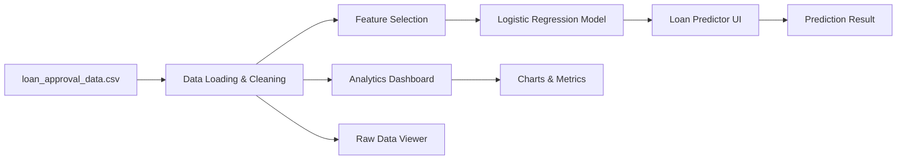

# CreditWise Loan Approval System

## Overview

This project is a loan approval analytics and prediction system built with Streamlit. It uses a loan applicant dataset (`loan_approval_data.csv`) to visualize approval trends, explore applicant characteristics, and provide a simple machine learning-based eligibility prediction interface.

There are two Streamlit applications included:

- `app.py`: Main application with a modern dashboard, approval predictor, and raw data viewer.
- `app.pu.py`: Simpler analytics dashboard version with basic visualizations.

## Key Features

- Data loading and cleanup for missing numeric/categorical values.
- Logistic Regression model trained on applicant data.
- Interactive dashboard metrics, approval distribution visualization, and scatter plots.
- Real-time loan approval prediction with user-provided input values.
- Raw dataset viewer and summary statistics.
- Sidebar filtering by `Employment_Status` when available.

## Architecture



## Dataset Schema

The dataset includes the following columns:

- `Applicant_ID`
- `Applicant_Income`
- `Coapplicant_Income`
- `Employment_Status`
- `Age`
- `Marital_Status`
- `Dependents`
- `Credit_Score`
- `Existing_Loans`
- `DTI_Ratio`
- `Savings`
- `Collateral_Value`
- `Loan_Amount`
- `Loan_Term`
- `Loan_Purpose`
- `Property_Area`
- `Education_Level`
- `Gender`
- `Employer_Category`
- `Loan_Approved`

## Requirements

Install dependencies from `requirements.txt`:

```bash
pip install -r requirements.txt
```

## Running the App

Start the main application with:

```bash
streamlit run app.py
```

To run the simpler dashboard version:

```bash
streamlit run app.pu.py
```

## What Each App Does

### `app.py`

- Loads and preprocesses the CSV dataset.
- Handles missing values for numeric and categorical data.
- Trains a Logistic Regression model on selected features:
  - `Applicant_Income`
  - `Credit_Score`
  - `Age`
  - `Existing_Loans`
- Displays a tabbed interface with:
  - `📊 Analytics Dashboard`
  - `🚀 Loan Predictor`
  - `📋 Raw Data`

### `app.pu.py`

- Loads the same dataset.
- Cleans missing values for numeric and categorical fields.
- Displays:
  - Loan approval class balance pie chart.
  - Applicant income distribution histogram.
  - Dataset summary statistics.

## Notes

- `app.py` is the recommended entry point for the full feature set and interactive prediction.
- `loan_approval_data.csv` must be present in the root project folder for both apps to work.
- Existing visualization assets like `loan_correlation_heatmap.png` and `full_correlation_heatmap.png` appear to be generated artifacts from exploratory analysis.

## Project Structure

- `app.py` - Main Streamlit analytics + prediction app.
- `app.pu.py` - Simpler Streamlit dashboard app.
- `loan_approval_data.csv` - Input dataset.
- `requirements.txt` - Python dependencies.
- `complete code/credit_wise.ipynb` - Additional notebook-based analysis.
- `loan_correlation_heatmap.png`, `full_correlation_heatmap.png` - Correlation visualization outputs.

## Recommended Next Steps

1. Verify the dataset columns and update model feature selection if additional predictive features are needed.
2. Improve the model by adding encoding for categorical variables and advanced feature engineering.
3. Add user input validation for the predictor interface.
4. Convert the Mermaid flow diagram into a rendered image if the final presentation requires an offline diagram asset.
