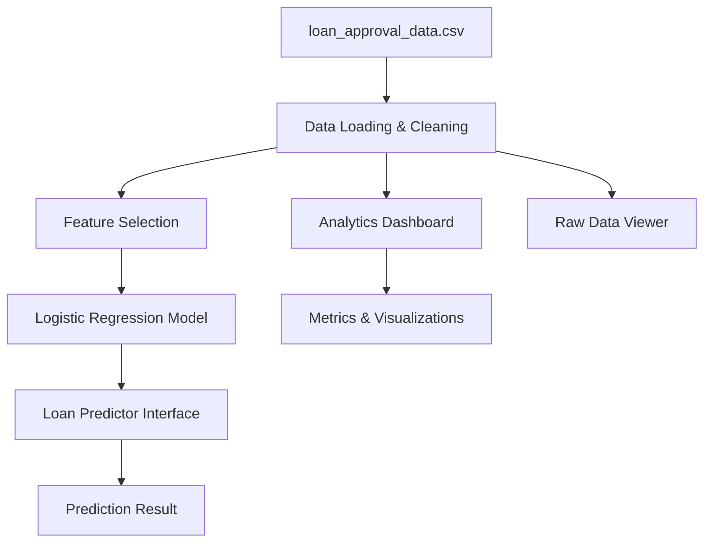

# CreditWise Loan Approval System

## Project Overview

This repository contains a Streamlit-based loan approval analytics and prediction system. The application loads loan applicant data from `loan_approval_data.csv`, cleans missing values, visualizes approval trends, and provides a simple logistic regression-based loan approval predictor.

## Included Applications

- `app.py` - Main Streamlit application with:
  - analytics dashboard
  - loan approval predictor
  - raw dataset viewer
- `app.pu.py` - Alternate Streamlit dashboard app with simplified visualizations.

## Key Features

- Data ingestion and preprocessing for numeric and categorical columns.
- Missing-value handling using mean imputation for numeric values and most frequent-value imputation for categorical fields.
- Logistic Regression model trained on applicant features.
- Interactive dashboard with key metrics and data visualizations.
- Real-time approval prediction interface.
- Raw dataset viewer and summary statistics.

## Dataset

The project depends on `loan_approval_data.csv` in the repository root.

### Dataset Columns

- `Applicant_ID`
- `Applicant_Income`
- `Coapplicant_Income`
- `Employment_Status`
- `Age`
- `Marital_Status`
- `Dependents`
- `Credit_Score`
- `Existing_Loans`
- `DTI_Ratio`
- `Savings`
- `Collateral_Value`
- `Loan_Amount`
- `Loan_Term`
- `Loan_Purpose`
- `Property_Area`
- `Education_Level`
- `Gender`
- `Employer_Category`
- `Loan_Approved`

## Architecture



## Requirements

Install dependencies from `requirements.txt`:

```bash
pip install -r requirements.txt
```

## Running the App

Start the full application:

```bash
streamlit run app.py
```

Start the simplified dashboard app:

```bash
streamlit run app.pu.py
```

## Script Summaries

### `app.py`

- Loads `loan_approval_data.csv`.
- Cleans missing values.
- Selects model features based on available dataset columns.
- Trains a Logistic Regression model.
- Displays:
  - approval rate metrics
  - approval distribution
  - income vs credit score scatter plot
  - loan approval predictor with confidence score
  - raw data viewer and descriptive statistics

### `app.pu.py`

- Loads the same dataset.
- Handles missing values.
- Displays:
  - class balance pie chart
  - applicant income distribution histogram
  - dataset summary statistics

## Notes

- `app.py` is the recommended entry point for the full dashboard experience.
- `loan_approval_data.csv` must be present in the project folder.
- The generated images `loan_correlation_heatmap.png` and `full_correlation_heatmap.png` are exploratory analysis artifacts.
- The notebook `complete code/credit_wise.ipynb` contains additional analysis and model experiments.

## Project Structure

- `app.py`
- `app.pu.py`
- `loan_approval_data.csv`
- `requirements.txt`
- `complete code/credit_wise.ipynb`
- `loan_correlation_heatmap.png`
- `full_correlation_heatmap.png`
